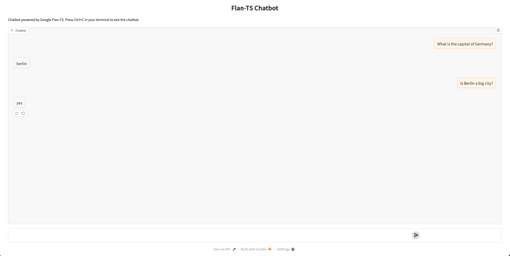

# Flan-T5 Chatbot

This is a simple conversational chatbot interface built with [Google's Flan-T5](https://huggingface.co/google/flan-t5-base) model using the 🤗 Transformers library. It maintains a conversation history with token budget control and is hosted with Gradio for easy interaction.

## 🔧 Features

- Conversational memory using past user and bot exchanges
- Truncates history dynamically to fit within a token budget
- Uses beam search for coherent response generation
- Simple and clean Gradio interface
- Deployable on localhost or server

## 🛠️ Tech Stack

- **Python**
- **Transformers (Hugging Face)**
- **Gradio** (for UI)

## 📦 Dependencies

Make sure you have the following packages installed:

```bash
pip install transformers gradio torch
```

## 📦 Installation

### Clone the repository:
```bash
git clone https://github.com/shaswatashaha/Hugging-Face-Transformer-Project.git
cd Hugging-Face-Transformer-Project/sentiment-analyzer

## 🚀 How to Run

Clone the repository and run the Python file:

```bash
python google_flan_chatbot.py
```

The chatbot will be available at [http://localhost:7860](http://localhost:7860) by default.

## 🧠 How It Works

- The `Chatbot` class loads a Flan-T5 model and tokenizer.
- `chat_with_history` manages a rolling conversation, keeping recent history within a token limit.
- Input + history is passed to the model for generating a response.
- The output is decoded and cleaned before display.

## 📸 Screenshot



## 📌 Notes

- Adjust `max_tokens` in `chat_with_history` to fit different model limits.
- This implementation uses `flan-t5-base`. You can switch to other Flan-T5 variants for better performance or efficiency.

## 📄 License

This project is licensed under the MIT License.
