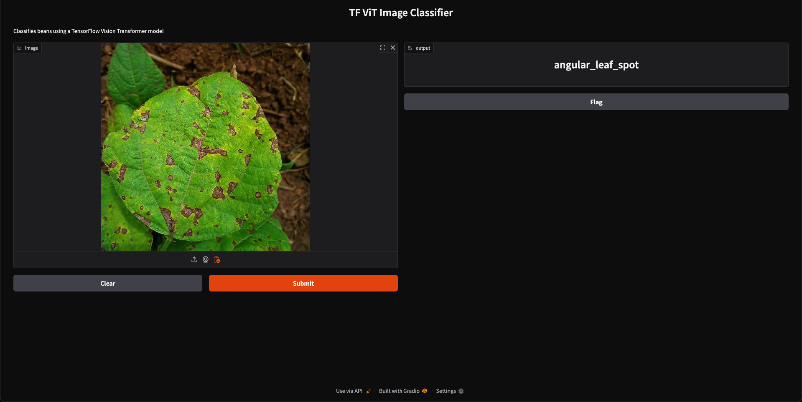

# 🌱 TF ViT Bean Classifier

This project is a TensorFlow-based image classifier for identifying bean leaf diseases using a Vision Transformer (ViT) model. It utilizes a pre-trained Hugging Face model fine-tuned on the **bean leaf dataset** to detect three common classes:

- **Healthy**
- **Angular Leaf Spot**
- **Bean Rust**

Unlike GPU-heavy models, this app is designed to run efficiently on CPU-based systems such as the Apple M1 Mac Mini.

---

## 🧠 Model Summary

- **Model**: [nateraw/vit-base-beans](https://huggingface.co/nateraw/vit-base-beans)
- **Architecture**: Vision Transformer (ViT-base-patch16-224)
- **Task**: Image classification
- **Framework**: TensorFlow (weights loaded from PyTorch using `from_pt=True`)

---

## 🛠️ Features

- 📷 Upload bean leaf images  
- 🧠 Classifies into one of three disease states  
- 🌐 Gradio interface for simple interaction  
- 🖥️ Lightweight – works on CPUs, no GPU required  

---

## 🚀 How to Run

### 1. Install Dependencies

```bash
pip install tensorflow transformers gradio pillow
```

### 2. Run the App

```bash
python vit_base_gradio.py
```

Then open your browser to: `http://localhost:7860`

---

## 📂 Files

| File                 | Purpose                                        |
|----------------------|------------------------------------------------|
| `vit_base_gradio.py` | The main Gradio interface and classification logic |
| `README.md`          | Project documentation                         |

---

## 📊 Sample Classes

Predictions will return one of the following labels:

- `healthy`
- `angular_leaf_spot`
- `bean_rust`

These correspond to common bean leaf conditions and can help in early diagnosis.

---

---

## 🖼️ Screenshot

Below is some examples of the Gradio interface after launching the app:




---

## 📄 License

MIT License

---

## 👨‍💻 Author

Adapted and developed by [Shaswata Shaha](https://github.com/shaswatashaha), based on Hugging Face models and inspired by the [iBean Project](https://github.com/AI-Lab-Makerere/ibean).
